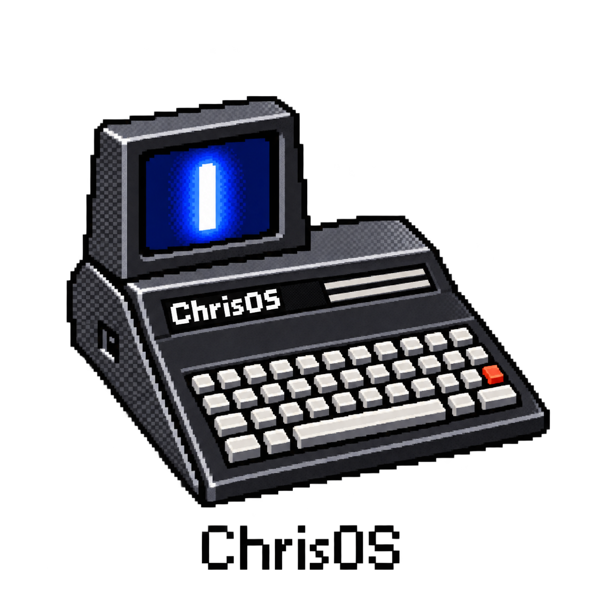

<div class="hero-retro">
  <div class="hero-system">CHRISOS / DOCUMENTAÇÃO / 2026</div>
  
  <div class="hero-eyebrow">O ECOSSISTEMA CHRISOS</div>
  <h1>Por dentro do ChrisOS</h1>
  <p>Um sistema operacional, uma linguagem e as ferramentas para construir ambos. Da primeira instrução ao desktop.</p>
  <div class="hero-actions">
    <a class="retro-button primary" href="inside-chrisos/">ENTRAR NA DOCUMENTAÇÃO</a>
    <a class="retro-button" href="../">EN</a>
    <a class="retro-button" href="https://github.com/christianrss/ChrisOS" target="_blank">CÓDIGO ↗</a>
  </div>
  <div class="hero-status"><span class="led"></span> EDIÇÃO DA FONTE: main @ da3df29 · 26 SET 2026</div>
</div>

## Mapa do sistema

```text
                         ChrisOS
                            │
           ┌────────────────┼────────────────┐
           │                │                │
        Kernel           ChrisC           ChrisFS
           │                │                │
   metal / drivers     compiler + CLVM    persistência
           │                │                │
           ├──── gráficos ──┼── aplicações ──┤
           │                │                │
      VirtIO / VirGL       JIT          Desktop / Tools
           │
       hardware real
```

## Caminhos de leitura

| Objetivo | Comece por | Continue |
|---|---|---|
| Rodar o projeto | [Compilar e executar](build-run/) | Boot → desktop → validação |
| Entender o S.O. | [Arquitetura](system-architecture/) | Memória → interrupções → processos → ChrisFS |
| Programar | [ChrisC](chrisc-language/) | CLVM → bibliotecas → IDE → toolchain |
| Entender GPU | [Gráficos 2D](graphics-2d/) | 3D software → VirtIO-GPU → VirGL → shaders |
| Acompanhar self-hosting | [Self-hosting](self-hosting/) | Toolchain → instalação → roadmap |

## Baseline atual

Esta edição no GitHub Pages acompanha a branch `main` do ChrisOS. O baseline desta migração é `da3df29`, substituindo o snapshot anterior do Sites em `feat/os2 @ 252b92e`.
